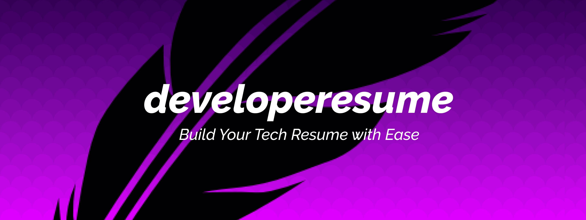
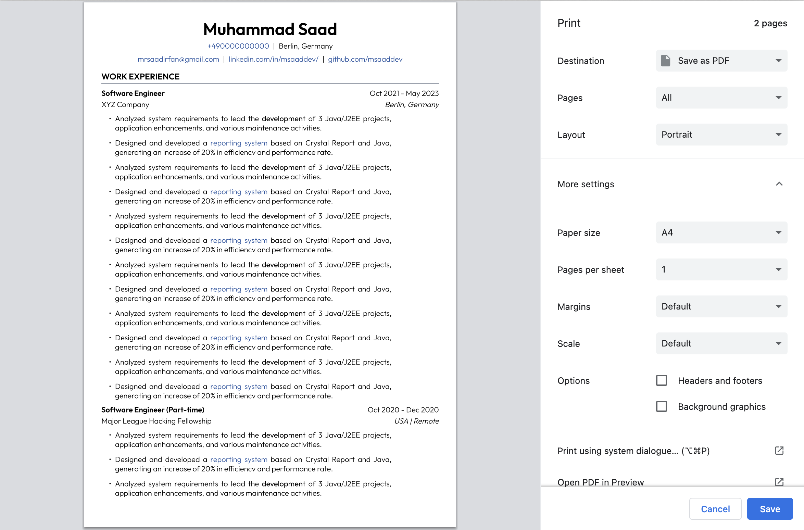

<div align="center">
	
		
	</a>
</div>
<br>

<p align="center">
	<strong>Quickly create your technical resume without formatting issues</strong>
</p>


- **Work Experience**: Add your work experience whether its one company or multiple
- **Education**: Easily add education whether it is university degree or bootcamp
- **Personal Projects**: Showcase your personal projects
- **Skills**: List down important programming, technical and soft skills
- **Notable Accomplishment**: Write down certifications, hackathon wins, speaking engagments, and more.

<br>

Once you have added your information, you can save the resume as **PDF**.

[*Live demo of the resume*](https://developeresume.vercel.app/)

<br>


## How it works

#### 1. Fork and clone

Go ahead and fork this repository. After that, clone your forked repo.

#### 2. Project setup

Open the clone repo in your preferred code editor. After this, run the following command in your terminal to install dependencies:

```sh
npm install
```

#### 3. Adding your data

Open the [`index.ts`](https://github.com/msaaddev/developeresume/blob/main/data/index.ts) file in `data/index.ts`. Go ahead and start adding your info there.

***Header***

Update the following object with your data to add the header:

```ts
header: {
	name: 'Muhammad Saad',
	phoneNumber: '+490000000000',
	location: 'Berlin, Germany',
	email: 'mrsaadirfan@gmail.com',
	linkedIn: 'linkedin.com/in/msaaddev/',
	github: 'github.com/msaaddev'
}
```

***Education***

It is an array of object. You can add as many education info as you like by duplicating the object inside the array.

```ts
education: [
	{
		id: uuidv4(),
		degree: 'B.Sc. of Computer Sciences',
		university: 'University of Engineering & Technology',
		location: 'Lahore, Pakistan',
		duration: 'Oct 2018 - May 2022'
	}
],
```

Keep the value of id set to `uuidv4()` in each of your education object.

If you don't want to add any education data, you can just keep the array empty like the following:

```ts
education: [

],
```
***Skills***

Just like above, it is also an array of objects. If you don't want to add a particular category of skills like "Soft Skills", you can just remove that object.

You can replace the objects inside this array with your skills.

```ts
skills: [
	{
		id: uuidv4(),
		name: 'Programming languages',
		skill: ['JavaScript', 'TypeScript']
	},
	{
		id: uuidv4(),
		name: 'Technologies',
		skill: [
			'Git',
			'HTML',
			'CSS',
			'React',
			'Next.js',
			'Redux Toolkit',
			'Tailwind CSS',
			'Styled Components',
			'MongoDB',
			'Node.js',
			'REST APIs'
		]
	},
	{
		id: uuidv4(),
		name: 'Soft Skills',
		skill: ['Ownership', 'Rigor', 'Team work', 'Communication']
	}
],
```

Keep the value of id set to `uuidv4()` in each of your skills object.

***Experience***

It is another array with each object representing a company. You can update the designation, company, location, duration, and tasks. Tasks is a string array. You can also pass HTML tags to your strings and it will render on your resume. This way, you can pass in important links and also bold/italic important words.

```ts
experience: [
	{
		id: uuidv4(),
		designation: 'Software Engineer (Part-time)',
		company: 'Major League Hacking Fellowship',
		location: 'USA | Remote',
		duration: 'Oct 2020 - Dec 2020',
		tasks: [
			`Analyzed system requirements to lead the <strong>development</strong> of 3 Java/J2EE projects, application enhancements, and various maintenance activities.`,
			`Designed and developed a <a href="https://google.com">reporting system</a> based on Crystal Report and Java, generating an increase of 20% in efficiencv and performance rate.`,
			`Analyzed system requirements to lead the <strong>development</strong> of 3 Java/J2EE projects, application enhancements, and various maintenance activities.`
		]
	}
]
```

You can duplicate the same object and add another company information.

If you don't have any professional experience, you can keep the experience array empty like the following:

```ts
experience: [

]
```

***Projects***

Array of object. Each object represents a personal project.

```ts
projects: [
	{
		id: uuidv4(),
		name: `<a href="https://github.com/msaaddev/jobboard">Jobboard</a>`,
		desc: `Built a PWA with <strong>HTML, CSS, JavaScript, Next.js</strong>, <strong>Firebase Auth</strong>, and <strong>Firestore</strong> to help developers get hired. Integrated features like user authentication, separate company and applicant dashboards, job posting, and job deleting.`
	},
	{
		id: uuidv4(),
		name: `<a href="https://github.com/msaaddev/jobboard">Jobboard</a>`,
		desc: `Built a PWA with <strong>HTML, CSS, JavaScript, Next.js</strong>, <strong>Firebase Auth</strong>, and <strong>Firestore</strong> to help developers get hired. Integrated features like user authentication, separate company and applicant dashboards, job posting, and job deleting.`
	},
],
```

If the project exists on GitHub or anywhere else, you can add its link by wrapping the project name with anchor tag. You can also add description for each project and provide appropriate HTML tags for bold/italic.

You can keep this array empty if there is no personal project.

```ts
projects: [

],
```

***Accomplishment***

It is string array where you can provide your accomplishment list. You can add links by passing the anchor tag and also bold/italic by using strong and em tags.

```ts
accomplishments: [
	`<a href="https://nextjs.org/conf/oct21/speakers/msaaddev">Speaker</a>`,
	`<a href="https://nextjs.org/conf">Next.js Global Community Conference</a> by Vercel, San Francisco (2021)`,
	`Runner Up, Major League Hacking DevTools Hackathon, Worldwide (2020)`,
]
```
#### 4. Save as PDF

Run the app locally by running the following command:

```sh
npm run dev
```

The app will run on [localhost:3000](http://localhost:3000/) so go ahead and open it. Now press <kbd>CTRL</kbd> (if on windows) or <kbd>CMD</kbd> if on mac and <kbd>P</kbd>. This will open the print menu.

In "More settings", uncheck "Headers and footers" in Options and press Save. A popup will appear. Click Save again.

The resume will be saved as PDF in your computer.



## Contributing Guidelines

Make sure you read the [contributing guidelines](https://github.com/msaaddev/developeresume/blob/main/contributing.md) before opening a PR.

## Other Projects

I have curated a [detailed list](https://github.com/msaaddev/open-source) of all the open-source projects I have authored. Do take out a moment and take a look.

## License & Conduct

-   MIT © [Saad Irfan](https://github.com/msaaddev)
-   [Code of Conduct](https://github.com/msaaddev/developeresume/blob/main/code-of-conduct.md)
